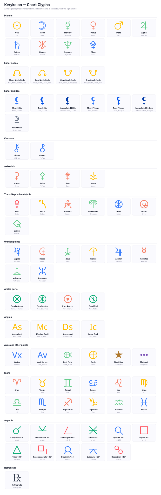

# Chart Glyphs

Visual reference for the astrological glyphs used in Kerykeion charts: planets, lunar nodes and apsides, centaurs, asteroids, Trans-Neptunian and Uranian points, Arabic parts, angles, zodiac signs and aspects.

Every glyph is geometry — no font is needed to render a chart. The colours shown are the light theme's; each is a CSS variable a theme can override.

## Glyphs by family

### Planets

| Glyph (id) | Name |
|---|---|
| `Sun` | Sun |
| `Moon` | Moon |
| `Mercury` | Mercury |
| `Venus` | Venus |
| `Mars` | Mars |
| `Jupiter` | Jupiter |
| `Saturn` | Saturn |
| `Uranus` | Uranus |
| `Neptune` | Neptune |
| `Pluto` | Pluto |

### Lunar nodes

| Glyph (id) | Name |
|---|---|
| `Mean_North_Lunar_Node` | Mean North Node |
| `True_North_Lunar_Node` | True North Node |
| `Mean_South_Lunar_Node` | Mean South Node |
| `True_South_Lunar_Node` | True South Node |

### Lunar apsides

| Glyph (id) | Name |
|---|---|
| `Mean_Lilith` | Mean Lilith |
| `True_Lilith` | True Lilith |
| `Interpolated_Lilith` | Interpolated Lilith |
| `Mean_Priapus` | Mean Priapus |
| `True_Priapus` | True Priapus |
| `Interpolated_Perigee` | Interpolated Perigee |
| `White_Moon` | White Moon |

### Centaurs

| Glyph (id) | Name |
|---|---|
| `Chiron` | Chiron |
| `Pholus` | Pholus |

### Asteroids

| Glyph (id) | Name |
|---|---|
| `Ceres` | Ceres |
| `Pallas` | Pallas |
| `Juno` | Juno |
| `Vesta` | Vesta |

### Trans-Neptunian objects

| Glyph (id) | Name |
|---|---|
| `Eris` | Eris |
| `Sedna` | Sedna |
| `Haumea` | Haumea |
| `Makemake` | Makemake |
| `Ixion` | Ixion |
| `Orcus` | Orcus |
| `Quaoar` | Quaoar |

### Uranian points

| Glyph (id) | Name |
|---|---|
| `Cupido` | Cupido |
| `Hades` | Hades |
| `Zeus` | Zeus |
| `Kronos` | Kronos |
| `Apollon` | Apollon |
| `Admetos` | Admetos |
| `Vulkanus` | Vulkanus |
| `Poseidon` | Poseidon |

### Arabic parts

| Glyph (id) | Name |
|---|---|
| `Pars_Fortunae` | Pars Fortunae |
| `Pars_Spiritus` | Pars Spiritus |
| `Pars_Amoris` | Pars Amoris |
| `Pars_Fidei` | Pars Fidei |

### Angles

| Glyph (id) | Name |
|---|---|
| `Ascendant` | Ascendant |
| `Medium_Coeli` | Medium Coeli |
| `Descendant` | Descendant |
| `Imum_Coeli` | Imum Coeli |

### Axes and other points

| Glyph (id) | Name |
|---|---|
| `Vertex` | Vertex |
| `Anti_Vertex` | Anti-Vertex |
| `East_Point` | East Point |
| `Earth` | Earth |
| `FixedStar` | Fixed Star |
| `Midpoint` | Midpoint |

### Signs

| Glyph (id) | Name |
|---|---|
| `Ari` | Aries |
| `Tau` | Taurus |
| `Gem` | Gemini |
| `Can` | Cancer |
| `Leo` | Leo |
| `Vir` | Virgo |
| `Lib` | Libra |
| `Sco` | Scorpio |
| `Sag` | Sagittarius |
| `Cap` | Capricorn |
| `Aqu` | Aquarius |
| `Pis` | Pisces |

### Aspects

| Glyph (id) | Name |
|---|---|
| `orb0` | Conjunction 0° |
| `orb30` | Semi-sextile 30° |
| `orb45` | Semi-square 45° |
| `orb60` | Sextile 60° |
| `orb72` | Quintile 72° |
| `orb90` | Square 90° |
| `orb120` | Trine 120° |
| `orb135` | Sesquiquadrate 135° |
| `orb144` | Biquintile 144° |
| `orb150` | Quincunx 150° |
| `orb180` | Opposition 180° |

### Retrograde

| Glyph (id) | Name |
|---|---|
| `retrograde` | Retrograde |
